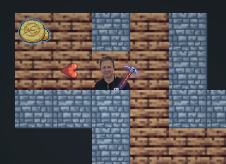

# Exploració del laberint - [Jairo Linares](https://github.com/JJairo-16)

**Versió amb estil CSS (local):**  
[README complet amb estils](./README.LOCAL.md)

---

## Què és?

És un joc d’exploració de laberints on el jugador es desplaça per un entorn desconegut, descobrint progressivament el mapa mentre busca la sortida. El sistema de visibilitat limita la informació disponible, fomentant l’orientació, la planificació dels moviments i l’exploració estratègica.



---

## Com es juga?

L’objectiu del joc és explorar un laberint fins a trobar la sortida. Al començament, el mapa és desconegut i només es revelen les zones properes al jugador a mesura que es desplaça. Això fa que el jugador hagi d’orientar-se amb la informació limitada disponible, planificar els moviments amb cura i explorar de manera estratègica per no perdre’s i arribar a la sortida.

### Controls

| **Tecla principal** | **Tecla secundària** | **Acció**               |
| ------------------- | -------------------- | ----------------------- |
| W                   | Fletxa amunt         | Anar cap amunt          |
| A                   | Fletxa esquerra      | Anar cap a l’esquerra   |
| S                   | Fletxa avall         | Anar cap avall          |
| D                   | Fletxa dreta         | Anar cap a la dreta     |
| E                   | Enter                | Utilitzar               |
| Shift               |                      | Esprintar               |
| Més                 |                      | Augmentar el zoom       |
| Menys               |                      | Disminuir el zoom       |
| Z                   |                      | Skin anterior           |
| X                   |                      | Següent skin            |
| 1                   |                      | Objecte anterior        |
| 2                   | Q                    | Següent objecte         |
| F1                  |                      | Alternar mostrar FPS    |
| F2                  |                      | Alternar poder monetari |
| ESC                 |                      | Obrir configuració      |

---

## Dependencies

- **Apache Maven**:
  
  > Eina de gestió i automatització de projectes que permet gestionar les dependències, compilar el codi i executar el projecte de manera senzilla.

- **Java 21**:

    > Versió del llenguatge de programació Java utilitzada per desenvolupar i executar l’aplicació. És necessari tenir el JDK 21 instal·lat al sistema.

---

## Frameworks

- **JavaFX**:
  
  > Framework gràfic utilitzat per construir la interfície d’usuari de l’aplicació. Proporciona components visuals, gestió d’esdeveniments i suport per a layouts responsius.

- **SLF4J**:
  
  > API de logging utilitzada per desacoblar el codi de l’aplicació de la implementació concreta de registre. Permet definir missatges de log consistents i configurar diferents nivells segons l’entorn d’execució.

---

## Com instal·lar maven

1. **Descomprimir apache maven:**
   <br>
   Descomprimir [apache-maven](dependencies/apache-maven-3.9.12-bin.zip) i copiar el contingut en un directori accessible per altres usuaris (es recomana `C:\apache-maven`).

2. **Afegir apache-maven al path del sistema:**
   <br>
   Crear una variable d'entorn de sistema per accedir a `apache-maven\bin` com `mvn`.

   Amb PowerShell:
    ```PowerShell
    setx PATH "$env:PATH;C:\ruta\al\maven\bin" /M
    ```

---

## The Ghost Room

*The Ghost Room* (o *Ghost Room*) és un **heisenbug conegut** que **no serà solucionat** completament, només desactivar.

Primera imatge capturada:  


 > Més informació a [The Ghost Room](maze/docs/The%20Ghost%20Room/docs.md).

### Símptomes

El jugador, en lloc d'aparèixer dins del laberint, apareix en una **habitació buida**
amb una única sortida en forma de passadís.

Aquesta sortida és **intransitable** a causa d'un **terra amb col·lisió fantasma**,
que incompleix les regles de col·lisió del joc tot i, aparentment, complir-les.

En altres paraules, *The Ghost Room* representa un estat en què el programa
**compleix i no compleix les regles simultàniament**.

### Causa

Aquest comportament és causat pel sistema de **generació del mapa**.
Tot i que és **impossible de reproduir intencionalment**, depèn completament
del **factor aleatori (RNG)**.

### Solució

No existeix una solució definitiva.
Per sortir de la *Ghost Room*, només cal **reiniciar el programa**.

---

## Llicència

Aquest programa està baix la llicencia [MIT](LICENSE).

 > Aquest projecte conté una petita referència visual inspirada en còmics de ciència-ficció populars. No s'hi pretén cap afiliació ni cap avaluació.